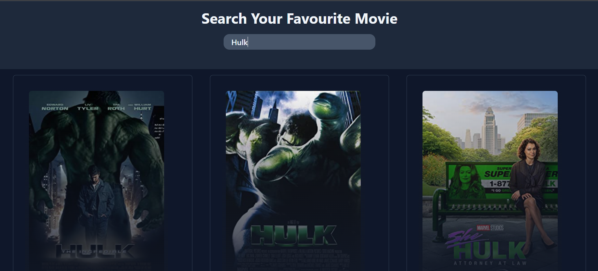

# ReactJS-CinemaSearch App 

<li>CinemaSearch is a ReactJS-based movie searching app that allows users to search for movies.
<li> The app has been designed using TailwindCSS. To ensure efficient data management, the app utilizes React Hooks and Context API.

----
### code -
1. [Home.js](./src/Home.js)
2. [ContextStore](./src/context/ContextStore.js)
3. [Components](./src/Components/readme.md)

----
### Deployed URL
[Ref. Link]()

### Preview
